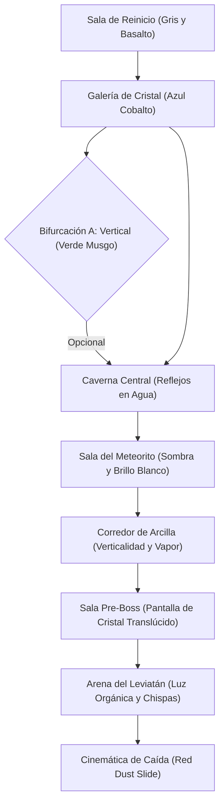
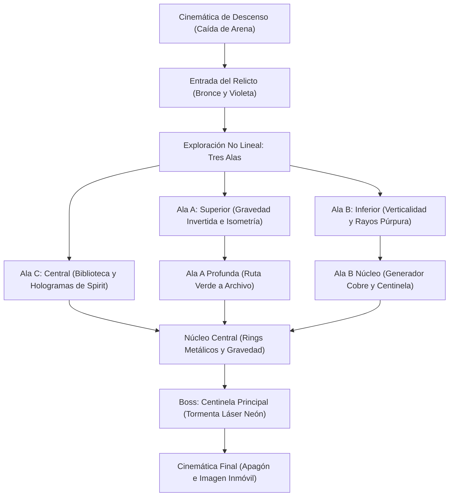

# Opportunity: Red Dust Legacy — Documentación de Elementos Gráficos y de Interfaz (HUD)

Este documento contiene la especificación exclusiva de todos los elementos visuales, artísticos y de interfaz de usuario del proyecto. No se incluyen detalles de implementación técnica, código de programación ni configuraciones del motor que no afecten directamente a la representación visual.

---

## 1. Guía de Estilo Visual y Paletas de Colores

El proyecto maneja una dirección artística diferenciada para cada entorno de juego, complementada por una paleta unificada para el protagonista y los elementos de la interfaz.

| Paleta | Uso y Aplicación | Colores Principales | Colores de Acento |
| :--- | :--- | :--- | :--- |
| **Rover + Interfaz (UI)** | Chasis, ruedas, HUD general y efectos de indicador del rover. | Naranja polvoriento (`#E07040`) <br> Gris metálico (`#8A9BA8`) <br> Blanco envejecido (`#F0EBE3`) | Azul indicador (`#3A8FC1`) <br> Verde sistema (`#4CAF50`) <br> Rojo alerta (`#F44336`) |
| **Nivel 1 — Las Cuevas** | Fondos, superficies de terreno e iluminación bioluminiscente. | Negro de cueva (`#0A0A12`) <br> Azul cristal (`#1A3A6E`) <br> Verde bioluminiscente (`#2ECC71`) | Turquesa de detalle (`#00BCD4`) <br> Blanco de destellos (`#E8F5E9`) |
| **Nivel 2 — El Relicto** | Estructuras alienígenas, fondos y redes de luz artificial. | Negro profundo (`#060610`) <br> Violeta alienígena (`#4A1A7A`) <br> Naranja oxidado (`#C0581A`) | Dorado de circuitos (`#B8860B`) <br> Cian tecnológico (`#00E5FF`) |

---

## 2. Proporciones y Escala de Entidades

Todos los sprites son dibujados a resolución original (1×) y escalados proporcionalmente dentro del motor del juego. El rover sirve como referencia base para la escala.

*   **Rover Opportunity**
    *   **Sprite original (1×):** 52 × 32 px
    *   **Escala relativa en pantalla:** ×1.0 (Referencia base)
    *   **Proporción y aspecto:** Silueta horizontal baja. Ruedas bien diferenciadas en la base y brazo robótico plegable/extensible en el extremo derecho.
*   **Ser Bioluminiscente**
    *   **Sprite original (1×):** 24 × 24 px
    *   **Escala relativa en pantalla:** ×0.75 respecto al rover
    *   **Proporción y aspecto:** Cuerpo esférico translúcido rodeado de pequeños tentáculos flotantes. Utiliza un shader de transparencia y emisión de luz verde-azul.
*   **Leviatán (Jefe Nivel 1)**
    *   **Sprite original (1×):** 96 × 64 px (solo cuerpo central)
    *   **Escala relativa en pantalla:** ×3.0 respecto al rover
    *   **Proporción y aspecto:** Masa central orgánica de gran tamaño. Los tentáculos actúan como elementos visuales independientes con movimiento oscilatorio. Posee un núcleo bioluminiscente central que se expone visualmente al jugador de manera intermitente.
*   **Drone Patrullero**
    *   **Sprite original (1×):** 32 × 20 px
    *   **Escala relativa en pantalla:** ×1.0 respecto al rover
    *   **Proporción y aspecto:** Estructura geométrica en forma de diamante horizontal. No posee ruedas; su suspensión visual se representa mediante propulsores traseros y partículas de calor.
*   **Drone Detector**
    *   **Sprite original (1×):** 36 × 36 px
    *   **Escala relativa en pantalla:** ×1.1 respecto al rover
    *   **Proporción y aspecto:** Diseño cúbico con un gran lente u ojo central emisor de luz. El cono de detección visual se dibuja en pantalla como un haz de luz cónico semitransparente.
*   **Centinela Secundario**
    *   **Sprite original (1×):** 44 × 52 px
    *   **Escala relativa en pantalla:** ×1.3 respecto al rover
    *   **Proporción y aspecto:** Estructura humanoide/vertical más alta que el rover. Cuenta con un cañón prominente de disparo acoplado a su hombro derecho.
*   **Centinela Principal (Jefe Final)**
    *   **Sprite original (1×):** 120 × 80 px
    *   **Escala relativa en pantalla:** ×3.75 respecto al rover
    *   **Proporción y aspecto:** Entidad mecánica masiva de diseño simétrico. Presenta tres grandes núcleos circulares emisores de luz en su chasis.

---

## 3. Especificación de Animaciones y Animator Controllers

Esta sección establece los estados de animación, número de frames y la velocidad en fotogramas por segundo (FPS) para el correcto ritmo visual de las entidades.

### 3.1 Rover Opportunity

El controlador de animación del protagonista gestiona tanto sus estados de movilidad nominales como las adaptaciones visuales por degradación.

| Estado de Animación | Cantidad de Frames | FPS | Comportamiento del Bucle (Loop) | Gatillo de Transición Visual | Prioridad de Entrega |
| :--- | :---: | :---: | :---: | :--- | :---: |
| **Idle** | 8 | 8 | Sí | Rover detenido sin desplazamiento. | MVP |
| **Run** | 10 | 12 | Sí | Rover en desplazamiento horizontal en el suelo. | MVP |
| **Jump_Rise** | 6 | 12 | No | Sprite en trayectoria ascendente de salto. | MVP |
| **Jump_Fall** | 4 | 8 | Sí | Sprite en trayectoria descendente de caída. | MVP |
| **Land** | 4 | 12 | No | Impacto y amortiguación al hacer contacto con el suelo. | MVP |
| **Dash** | 6 | 24 | No | Desplazamiento rápido horizontal con estela de partículas. | MVP |
| **Damage** | 5 | 12 | No | Parpadeo y sacudida al recibir un impacto de daño. | MVP |
| **Death** | 12 | 8 | No | Secuencia de colapso, apagado de luces y caída de componentes. | MVP |
| **Scan_Loop** | 8 | 8 | Sí | Emisión constante de ondas circulares desde el chasis. | MVP |
| **Idle_Degrade** | 8 | 8 | Sí | Variación del estado inactivo con temblores visuales y chisporroteos. | V2 |
| **Run_Limp** | 12 | 12 | Sí | Animación de avance defectuoso, arrastrando una de sus ruedas. | V2 |
| **Dash_End** | 4 | 12 | No | Recuperación y frenado visual tras completar un dash. | V2 |
| **Wall_Slide** | 6 | 8 | Sí | Rover aferrado a una superficie vertical, deslizándose hacia abajo. | V2 |
| **Wall_Jump** | 5 | 12 | No | Impulso lateral desde una pared. | V2 |
| **Climb_Start** | 4 | 12 | No | Transición visual al sujetarse a una pared. | V2 |
| **Climb_Loop** | 6 | 8 | Sí | Desplazamiento vertical ascendente o descendente en pared. | V2 |
| **Climb_End** | 4 | 12 | No | Transición visual al soltarse de la pared. | V2 |
| **Scan_Start** | 5 | 12 | No | Destello inicial al activar la antena de escaneo. | V2 |

### 3.2 Animación de Enemigos

| Enemigo | Estado de Animación | Frames | FPS | Contexto Visual |
| :--- | :--- | :---: | :---: | :--- |
| **Ser Bioluminiscente** | `Float_Idle` | 8 | 8 | Suspensión inactiva en el aire con pulsación de brillo. |
| | `Float_Alert` | 6 | 12 | Orientación rápida y aumento en la frecuencia de parpadeo. |
| | `Float_Chase` | 6 | 12 | Avance rápido hacia el rover con tentáculos extendidos. |
| | `Death` | 8 | 8 | Desvanecimiento de brillo y disolución en partículas. |
| **Drone Patrullero** | `Patrol` | 6 | 8 | Vuelo horizontal constante a velocidad estable. |
| | `Chase` | 6 | 12 | Inclinación visual hacia adelante y aumento del flujo del propulsor. |
| | `Attack` | 4 | 12 | Destello en el cañón previo al disparo. |
| | `Death` | 8 | 10 | Explosión mecánica seguida de caída libre del chasis. |
| **Drone Detector** | `Patrol` | 6 | 8 | Oscilación vertical de vigilancia. El cono de luz barre el suelo. |
| | `Alert` | 4 | 12 | El cono de luz cambia de color a ámbar/rojo de manera intermitente. |
| | `Chase` | 6 | 12 | Desplazamiento rápido con el lente fijo en el rover. |
| | `Attack` | 5 | 12 | Destello concentrado en el lente central. |
| | `Search` | 6 | 8 | El cono de luz barre rápidamente el entorno buscando al rover. |
| | `Death` | 8 | 10 | Cortocircuito visible (chispas) y desprendimiento del lente. |
| **Centinela Principal** | `Idle` | 8 | 8 | Pulsación inactiva de sus tres núcleos de energía. |
| | `Attack_F1` | 10 | 12 | Apertura de placas protectoras y brillo en los cañones. |
| | `Attack_F2` | 12 | 12 | Los núcleos brillan con mayor intensidad y cambian de ritmo. |
| | `Enrage` | 8 | 16 | Flujo errático de partículas alrededor de la estructura. |
| | `Death` | 32 | 8 | Secuencia de explosiones internas sucesivas y colapso de la estructura. |

---

## 4. Diseño Visual de Niveles y Entornos

### 4.1 Nivel 1 — Las Cuevas Bioluminiscentes (Dirección y Cronología Visual)

*   **Atmósfera y Bioma:** Entorno orgánico y subterráneo formado por cavernas de basalto oscuro y cristal marciano. El ambiente visual transmite una sensación de aislamiento y misterio natural, donde la geología interactúa con una biosfera subterránea extraña.
*   **Iluminación:** Luz ambiental muy tenue de color azul cobalto y verde esmeralda, emitida de manera natural por los cristales y hongos del entorno. Los destellos de luz dinámica provienen del faro frontal (Pancam) del rover, creando sombras alargadas que se proyectan sobre las formaciones rocosas y revelan detalles en la oscuridad.
*   **Planos Visuales (Parallax 2.5D):**
    *   *Fondo Lejano:* Siluetas monumentales de cavernas oscuras e insondables, con pequeños grupos de partículas bioluminiscentes suspendidas que parpadean lentamente.
    *   *Plano Medio:* Estalactitas colgantes, arcos naturales y grandes formaciones de cristal de tamaño medio que reaccionan aumentando temporalmente su luminosidad al ser escaneadas.
    *   *Primer Plano (Foreground):* Siluetas rocosas muy oscuras, restos de sedimentos marcianos y salientes minerales que enmarcan la pantalla y generan marcos de profundidad.

#### 4.1.1 Organismos y Elementos del Entorno (Ficha Gráfica)
*   **Hongo Luminus:** Agrupaciones de setas bioluminiscentes de tallo largo y sombreros de color cian brillante. Emiten una pulsación de luz tenue constante y actúan como objetos de lore escaneables.
*   **Cristal Azul:** Formaciones de cuarzo de alta pureza con geometría afilada y tonos azulados profundos. Actúan como reflectores naturales de la luz ambiental (recurso no renovable).
*   **Evaflora:** Pequeñas partículas flotantes de color verde esmeralda y turquesa que emergen del suelo y ascienden perezosamente hacia el techo de la cueva, simulando un polen brillante constante.
*   **Sporex:** Esferas orgánicas flotantes de color violeta y magenta con texturas pulsantes y espinas bioluminiscentes. Flotan a la deriva en pasajes verticales; al aproximarse el rover, el HUD despliega un recuadro de advertencia visual color púrpura indicando peligro de contacto.
*   **Geyser Luminoso:** Columnas de vapor de agua y gas presurizado que emergen de fisuras en el suelo, teñidas de un color cian brillante debido al arrastre de microcristales luminosos suspendidos.

#### 4.1.2 Línea de Tiempo y Progresión Visual del Nivel (Timeline Estético)



1.  **Inicio — Sala de Reinicio:** El nivel comienza con la pantalla en negro absoluto. Las líneas de inicialización del HUD parpadean en cian sobre la pantalla, y el faro de Opportunity se enciende de golpe, proyectando un haz de luz cónico blanco sobre una pared de basalto oscuro y polvo. La atmósfera es fría, estéril y desolada, con partículas de polvo flotando en el haz del faro.
2.  **Zona 1 — Galería de Cristal:** La cueva se ensancha hacia la derecha. Aparecen las primeras vetas de cristal azul incrustadas en el suelo rocoso, proyectando destellos sobre el terreno. Al fondo, la luz azul cobalto baña el escenario. Dos Seres Bioluminiscentes flotan en el plano medio, con sus cuerpos translúcidos pulsando en sintonía con las formaciones de Hongo Luminus de los bordes. Las plataformas de piedra son planas y estables.
3.  **Bifurcación A (Opcional — Rueda Reforzada):** Una ruta opcional que asciende por un pozo vertical. Visualmente destaca por arcos de roca cubiertos de musgo verde bioluminiscente. Pequeños salientes rocosos brillan con esporas verdosas. En el punto más alto, un receptáculo metálico derruido emite un brillo cian intenso que revela la ubicación de la mejora Rueda Reforzada, situada junto al primer Checkpoint (un panel de diagnóstico metálico que emite un pulso de luz de 1.2s al activarse).
4.  **Zona 2 — Caverna Central:** Punto de encuentro de las rutas. El entorno se abre en una gran cámara con estanques de agua marciana subterránea en el suelo, que reflejan con gran claridad las estalactitas brillantes del techo. En el centro, el meteorito de hierro (SC-02) brilla con una textura metálica rugosa y reflejos plateados. El ambiente cromático aquí mezcla el azul profundo con reflejos verdosos de la vegetación subterránea.
5.  **Zona 3 — Sala del Meteorito:** El camino se estrecha en un desfiladero rocoso de sombras densas. La iluminación natural disminuye y el color predominante pasa a ser un azul grisáceo oscuro. En esta zona se introduce al Drone Patrullero, cuyo sensor frontal rojo contrasta fuertemente con la paleta fría de la cueva. El contenedor de la mejora Escaneo Mejorado destaca en un pedestal de roca como un faro de luz blanca que ilumina el entorno inmediato.
6.  **Zona 4 — Corredor de Arcilla:** Una gran grieta vertical que obliga al jugador a ascender mediante saltos y escalada de paredes. La roca de basalto da paso a capas de arcilla húmeda con vetas doradas que brillan sutilmente. El aire se llena de esporas de Sporex flotantes de color magenta que se desplazan de lado a lado. En el fondo, los Geysers Luminosos disparan chorros de vapor turquesa a intervalos regulares, iluminando de manera intermitente las plataformas móviles de piedra.
7.  **Sala Pre-Boss:** Una cámara silenciosa donde la música se reduce a un zumbido de viento y goteo. La pantalla está dominada por una inmensa pared de cristal azul translúcido en el plano medio. A través de este cristal se puede ver la silueta distorsionada y masiva del Leviatán moviéndose lentamente en el fondo de la siguiente cámara. El entorno está bañado por una luz fría azul-celeste uniforme. Contiene el Checkpoint 3 y una celda de energía brillante en un nicho de cristal.
8.  **Boss — Leviatán:** Una arena cerrada de basalto circular. Al entrar, la entrada se bloquea visualmente por el derrumbe de rocas basálticas. La criatura emerge de un estanque bioluminiscente verde en la parte derecha de la sala. La iluminación del combate es caótica: el núcleo naranja del boss brilla intensamente cuando se expone a ataques, proyectando destellos anaranjados que contrastan con los tonos azules del escenario y las chispas eléctricas que desprenden los sistemas dañados del rover.
9.  **Transmisión / Transición — Acto II:** Al derrotar al Leviatán, se produce un temblor de tierra. El suelo de basalto se fractura visualmente, abriendo una gran grieta. Opportunity cae en el abismo. La cámara acompaña la caída del rover mientras este se desliza por una empinada rampa de arena roja y polvo fino. La luz azul de la caverna desaparece rápidamente, siendo reemplazada por la oscuridad absoluta que da inicio a la cinemática de descenso al Nivel 2.

---

### 4.2 Nivel 2 — El Relicto (Dirección y Cronología Visual)

*   **Atmósfera y Bioma:** Estructura arquitectónica colosal y subterránea construida por una civilización alienígena extinta. Se caracteriza por un diseño de ángulos no euclidianos, pasillos inclinados y salas monumentales que desafían la perspectiva visual del jugador, transmitiendo una sensación de antigüedad tecnológica y peligro latente.
*   **Iluminación:** Paleta de luz artificial en tonos violeta y naranja oxidado. Luces lineales que corren por el suelo, las paredes y los techos como circuitos digitales activos que guían la mirada. Los reflejos en el metal pulido y los cristales de control generan un brillo de alta intensidad en los bordes de las superficies.
*   **Planos Visuales (Parallax 2.5D):**
    *   *Fondo Lejano:* Megatructuras angulares con engranajes concéntricos colosales que rotan de manera imperceptible. La profundidad se enfatiza mediante capas de niebla violeta artificial.
    *   *Plano Medio:* Columnas isométricas con grabados alienígenas que se iluminan al paso del rover, pasarelas suspendidas y barreras de energía de color naranja.
    *   *Primer Plano (Foreground):* Fragmentos flotantes de metal alienígena inerte y cables rotos que cuelgan del techo, desenfocados por la profundidad de campo de la cámara de juego.

#### 4.2.1 Materiales y Arquitectura del Relicto (Ficha Gráfica)
*   **Metal Alienígena No Euclidiano:** Superficies de aleación oscura con textura de cepillado metálico. Los bloques y plataformas se unen sin tornillos ni remaches, con ángulos isométricos de 26° y líneas oblicuas que dan apariencia de profundidad arquitectónica.
*   **Energía Artificial:** Líneas luminiscentes de color cian y violeta incrustadas en las uniones de las placas metálicas, que pulsan en patrones de flujo digital simulando un sistema eléctrico aún funcional.
*   **Bioluminiscencia Residual:** Capas de material orgánico fosilizado de color púrpura que cubren parcialmente las esquinas y uniones del Relicto, remanente de los seres que habitaron el lugar.
*   **Cristales de Control:** Fragmentos de cristal de color violeta intenso y geometría hexagonal regular, colocados en terminales y consolas. Actúan como focos de luz direccional y puntos de interacción visual.

#### 4.2.2 Línea de Tiempo y Progresión Visual del Nivel (Timeline Estético)



1.  **Cinemática de Descenso:** Se muestra el chasis de Opportunity cayendo en una pendiente empinada de arena y polvo marciano rojo. El rover frena bruscamente al golpear una superficie metálica plana de color bronce. La cámara se aleja y revela la entrada del Relicto: una inmensa puerta circular con grabados concéntricos retroiluminados en violeta.
2.  **Entrada del Relicto:** Un pasillo colosal bañado en tonos bronce-naranja y violeta oscuro. Opportunity se sitúa sobre un suelo de metal pulido que refleja la luz ambiental. El primer Checkpoint se activa en un terminal alienígena de aspecto monolítico. Delante de él, el contenedor del upgrade Escudo de Plasma brilla con un campo de fuerza esférico de color cian que parpadea rítmicamente.
3.  **Ala A — Superior (Pasillos Inclinados y Gravedad Invertida):** Esta zona introduce una arquitectura visualmente disociadora. Los corredores se inclinan de golpe a 45 grados y algunas plataformas de metal flotan en campos de gravedad invertida (las partículas caen hacia el techo en lugar de hacia el suelo). Las luces del HUD del rover parpadean levemente para reflejar la distorsión del entorno. Un Drone Detector patrulla la zona, barriendo el escenario con un haz de luz cónico azulado que cambia instantáneamente a rojo alerta si detecta al rover.
4.  **Ala A — Profunda:** La paleta de colores cambia a un verde metálico apagado e industrial. Los pasadizos son estrechos y oscuros, iluminados únicamente por pequeños terminales alienígenas. El polvo del aire se ve más denso y el faro del rover resalta partículas metálicas en suspensión. Esta ruta conduce al acceso del archivo central.
5.  **Ala B — Inferior (Cámaras Verticales y Corrientes de Energía):** Una serie de pozos verticales masivos donde los fondos revelan generadores y turbinas engranadas en constante movimiento en el parallax. Rayos de energía violeta cruzan de una columna a otra a intervalos regulares, obligando al jugador a realizar saltos precisos sobre plataformas metálicas suspendidas. En la zona más profunda se encuentra el upgrade de la Batería EMP, que emite un destello azul eléctrico persistente en su contenedor metálico.
6.  **Ala B — Núcleo (Generador Central):** Una bóveda cilíndrica de metal cobrizo brillante dominada por el núcleo de energía del Relicto (SC-08). El núcleo es una esfera de luz dorada pulsante rodeada por anillos de metal concéntricos que giran a gran velocidad. El área está custodiada por un Centinela Secundario, cuyo cuerpo mecánico de color gris y cañón de hombro brillan con indicadores cian.
7.  **Ala C — Central (Transmisión de Spirit):** La biblioteca o archivo del Relicto. Las paredes están cubiertas por miles de pequeños cristales de control de color violeta incrustados en celdas de metal. El ambiente visual es solemne y oscuro, con un tono azulado y morado uniforme. En el centro de la sala se encuentra la terminal del archivo Spirit (SC-06). Al interactuar con ella, la pantalla se divide verticalmente en dos mitades (split-screen): la parte derecha muestra la interfaz monocromática de Spirit apagándose, mientras la izquierda congela visualmente a Opportunity procesando la señal en medio de la gran biblioteca alienígena silenciosa.
8.  **Núcleo Central (Sala de Transmisión Final):** El corazón de la instalación. Una inmensa bóveda esférica donde los tres caminos convergen. Enormes cables de datos cubiertos de bioluminiscencia púrpura corren por las paredes hacia un dispositivo de transmisión gigante suspendido en el centro de la sala. Los fondos muestran una tormenta de energía violeta que gira lentamente en el vacío del abismo inferior. Contiene el Checkpoint 4 y una última celda de energía dorada.
9.  **Boss — Centinela Principal:** El dispositivo de transmisión central se despliega y revela al Centinela Principal, una gran máquina de diseño esférico y simétrico con tres núcleos de energía cian. El combate satura visualmente la pantalla con proyectiles de láser en abanico de color cian brillante y esferas de rastreo de color violeta. En la fase final del combate, el fondo de la sala sufre cortocircuitos masivos, con relámpagos de energía púrpura que rasgan el escenario y deforman los grabados de las paredes.
10. **Cinemática Final:** Tras la derrota del boss, la iluminación de combate se extingue. Opportunity se arrastra lentamente hacia la consola central del transmisor. La pantalla muestra los últimos parpadeos de color ámbar y rojo de la barra de energía del rover, antes de que el monitor de telemetría de la escena final inicie la secuencia de apagón de sistemas y fundido a negro definitivo de 10 segundos.

---


---

## 5. Técnicas de Profundidad Visual (2.5D)

Para lograr el efecto de tridimensionalidad en una perspectiva de juego lateral, se aplican de forma integrada las siguientes directrices gráficas:

*   **Parallax Multi-capa:**
    *   **Nivel 1:** Configurado en tres capas independientes de fondo que se desplazan a diferentes velocidades respecto al movimiento de la cámara (Fondo de cristal lejano, formaciones medianas y primer plano rocoso).
    *   **Nivel 2:** Configurado en cuatro capas de fondo que detallan la geometría interna del Relicto.
*   **Proyección Axonométrica (Ángulo Isométrico):**
    *   Aplicada exclusivamente en las plataformas y estructuras de fondo del Nivel 2.
    *   Los elementos se dibujan a un ángulo visual de 26° sobre la horizontal para sugerir caras superiores y laterales, pintando la superficie superior con un tono notablemente más claro para acentuar el volumen. El plano de juego directo permanece puramente bidimensional (ortogonal).
*   **Escala y Saturación en el Eje Z:**
    *   *Elementos de Primer Plano (Foreground):* Escalados al 110%–120% del tamaño estándar, con colores oscuros y baja iluminación para no obstruir el plano de juego.
    *   *Elementos de Fondo:* Escalados al 60%–70% del tamaño estándar y con una reducción del 30% en la saturación del color para simular distancia atmosférica.
    *   *Enemigos y Drones en el Fondo:* Escalados al 50% de su tamaño nominal, moviéndose de manera puramente estética como parte de la decoración ambiental.
*   **Billboarding:**
    *   Los efectos de partículas en el aire (polvo marciano, destellos de escaneo, bioluminiscencia y partículas de daño) se orientan de forma constante de cara a la pantalla para evitar que se perciban como planos bidimensionales al desplazarse la cámara.
*   **Sombras Planares y de Luz 2D:**
    *   El rover proyecta una sombra dinámica en el suelo según las fuentes de luz circundantes.
    *   Los seres bioluminiscentes proyectan una sombra suave de baja opacidad (40%) en las paredes del fondo, permitiendo anticipar su posición visual antes de que entren directamente en la pantalla de juego.

---

## 6. Especificación del HUD (Interfaz de Usuario)

La interfaz se diseña con un enfoque diegético, simulando la pantalla del sistema operativo interno de Opportunity.

### 6.1 Distribución y Elementos del HUD (Resolución de Producción: 1920×1080)

1.  **Barra de Integridad Estructural (SI):**
    *   *Ubicación:* Esquina superior izquierda (Top-left, a una distancia de 32px del borde).
    *   *Representación:* Indicador de barra deslizante horizontal con indicador numérico. Al recibir daño, realiza un pulso de escala visual (1.0 → 1.08 → 1.0 en 0.12 segundos).
2.  **Slots de Celda de Energía (x2):**
    *   *Ubicación:* Esquina superior izquierda, inmediatamente debajo de la barra de SI.
    *   *Representación:* Dos slots circulares. Icono lleno representa un color verde/azul brillante; icono vacío se muestra apagado en un tono gris al 40% de opacidad. Al consumirse la celda, el slot parpadea en un ciclo rápido de brillo.
3.  **Contador de Sol:**
    *   *Ubicación:* Centro superior (Top-center, a 28px del borde superior).
    *   *Representación:* Texto monoespaciado que muestra el número de día marciano activo (`SOL [N]`).
4.  **Estado de Transmisión:**
    *   *Ubicación:* Esquina superior derecha (Top-right, a 32px del borde).
    *   *Representación:* Icono de antena parabólica acompañado de texto de estado del enlace. Muestra un destello visual verde cada 8 segundos para simular un ping de transmisión.
5.  **Slots de Upgrades Activos:**
    *   *Ubicación:* Esquina inferior izquierda (Bottom-left, a 32px del borde inferior).
    *   *Representación:* Hasta 4 iconos de mejoras equipadas. Se muestran en gris opaco hasta que la mejora correspondiente es desbloqueada. Al usarse, se aplica un efecto de barrido visual para indicar el tiempo de recarga (cooldown).
6.  **Minimapa:**
    *   *Ubicación:* Esquina inferior derecha (Bottom-right, a 32px del borde).
    *   *Representación:* Radar circular con un degradado en los bordes que desvanece el terreno periférico. Muestra un radio equivalente a 10 unidades alrededor del rover.
7.  **Alert Strip:**
    *   *Ubicación:* Centro inferior (Bottom-center, anclado al borde).
    *   *Representación:* Caja rectangular semitransparente que se muestra solo ante mensajes urgentes del sistema en mayúsculas fijas. Desaparece con un desvanecimiento (fade-out) de 0.5 segundos.

### 6.2 Rangos y Comportamiento Cromático de la Interfaz

La coloración del HUD y los efectos de pantalla cambian en tiempo real de acuerdo con el porcentaje de Integridad Estructural (SI) restante del rover:

| Estado de Integridad (SI) | Rango de SI | Color de Barra y Elementos | Color de Texto Numérico | Efectos Adicionales en Pantalla |
| :--- | :---: | :--- | :--- | :--- |
| **NOMINAL** | 100% – 61% | Verde (`#4CAF50`) | Blanco | Interfaz limpia sin interferencias. |
| **ADVERTENCIA** | 60% – 41% | Ámbar (`#FFA726`) | Ámbar | La antena del rover tiembla visualmente en reposo. |
| **CRÍTICO** | 40% – 21% | Rojo (`#F44336`) | Rojo parpadeante | Pantalla con un tinte general naranja semitransparente. |
| **EXTINCIÓN** | 20% – 1% | Rojo oscuro (`#8B0000`) | Rojo oscuro parpadeante rápido | Tinte naranja intenso en pantalla, efectos de estática de TV en los bordes y parpadeos intermitentes de apagón (pantalla a negro). |

---

## 7. Presentación Visual del Lore y Texto en Pantalla

*   **Tipografía de Lore:** Fuente monoespaciada de tamaño fijo que imita la salida en pantalla de un terminal de computación antiguo.
*   **Colores de Datos:**
    *   *Blanco:* Información de análisis geológico o científico estándar.
    *   *Ámbar:* Registro de advertencias climáticas o ambientales.
    *   *Rojo:* Datos alienígenas, anomalías del Relicto o archivos sin clasificar.
*   **Efecto de Glitch Visual por Daño:** Si la integridad del rover cae por debajo del 29%, el texto de los escaneos en pantalla comienza a mostrar caracteres corruptos aleatorios (`@`, `#`, `%`, `&`, `_`) y parpadeos en las letras, aumentando la proporción de corrupción visual a medida que se reduce la integridad.

---

## 8. Fases de Degradación Visual del Rover

La degradación del rover no es una simple métrica, sino un recurso visual que refleja el daño acumulado en su estructura:

1.  **Fase 1 (100% – 74% de SI):** Rover en su estado original de fábrica. Sprite limpio, sin marcas de desgaste ni polvo.
2.  **Fase 2 (73% – 61% de SI):** Capa visible de polvo marciano rojizo cubriendo los paneles solares superiores. La antena vibra levemente de manera constante.
3.  **Fase 3 (60% – 47% de SI):** Rueda trasera derecha con deformación física visible en el sprite. Panel solar principal con una grieta transversal en la superficie de las celdas.
4.  **Fase 4 (46% – 29% de SI):** Rueda delantera derecha doblada con un ángulo de desalineación visible. Lente de la cámara Pancam principal agrietada. Antena parcialmente caída hacia un lado.
5.  **Fase 5 (28% – 9% de SI):** Brazo robótico delantero colgando inerte sobre el chasis. Dos ruedas muestran daño estructural grave. Rayas y abolladuras oscuras visibles en el chasis metálico.
6.  **Fase 6 (8% – 1% de SI):** Estado visual de destrucción máxima. El rover se arrastra sobre sus ejes deformados dejando un rastro continuo de fricción en el suelo. Humo de partículas muy ligero emanando del chasis.

---

## 9. Secuencias Visuales y Cinemáticas

### 9.1 Escena de la Transmisión de Spirit (Ala C)

*   **Formato Visual:** Pantalla partida verticalmente en dos mitades:
    *   *Lado Izquierdo (Opportunity):* Imagen del escáner del Relicto en tonos de visión nocturna de Opportunity.
    *   *Lado Derecho (Spirit):* Reproducción de telemetría de archivo recuperada. Imagen monocromática estática de Spirit atrapado en la duna de Marte.
*   **Detalle en Pantalla:** A la derecha se muestran registros numéricos descendentes en texto verde. El valor de la batería se visualiza cayendo progresivamente de 12% a 0% durante 40 segundos, hasta congelar el log final con la línea: `TEMPERATURA INTERNA: -40C. BATERIA: 0%. MODO: --`.
*   **Alerta en Pantalla:** El HUD de Opportunity sobreimprime un indicador intermitente con el texto: `SENAL IDENTIFICADA: ROVER CLASE MER-A` que permanece activo durante 3 segundos antes del fundido a negro del lado derecho.

### 9.2 Cinemática del Final (Secuencia Escena por Escena)

1.  **Escena 1 (El último intento):** Primer plano detallado del brazo robótico del rover extendiéndose con lentitud y temblor para conectar el cable de transmisión del Relicto. Falla en el primer intento al resbalarse de la ranura; se reacomoda y lo inserta con éxito tras un retraso visible (1.2 segundos).
2.  **Escena 2 (Transmisión interrumpida):** Plano del HUD del rover mostrando la barra de progreso de transmisión de datos subiendo en pantalla: `1%... 11%... 23%... 38%`. La barra se detiene súbitamente al agotarse la energía a 0%. Se muestra un aviso estático del sistema: `ENERGIA INSUFICIENTE. Fragmentos transmitidos: 341 / 891`.
3.  **Escena 3 (El apagón de sistemas):** Las lecturas del HUD de Opportunity se apagan una a una, línea por línea, de arriba hacia abajo. La última línea visible, en color verde, muestra: `PROTOCOLO DE MISION: COMPLETADO`. Fundido a negro completo.
4.  **Escena 4 (El silencio):** Pantalla en negro absoluto y estático durante 10 segundos continuos. Sin texto, sin audio, sin indicadores.
5.  **Escena 5 (El informe):** Aparece texto blanco centrado sobre fondo negro de manera progresiva (fade de 0.8 segundos por línea):
    *   *Línea 1:* "El Jet Propulsion Laboratory de la NASA recibió 341 fragmentos de datos."
    *   *Línea 2:* "La señal fue rastreada hasta la superficie de Marte, confirmando su origen en el rover Opportunity."
    *   *Línea 3:* "Los datos transmitidos confirman la existencia de agua líquida subterránea activa y restos de vida microbiana antigua."
    *   *Línea 4:* "El Congreso aprueba de forma inmediata los fondos para la primera misión humana tripulada a Marte, con llegada estimada en 2037."
6.  **Escena 6 (Marte, 2037):** Un astronauta en traje espacial camina lentamente sobre la arena roja de Marte. La cámara está ubicada a nivel del suelo, mostrando únicamente las piernas y guantes del tripulante sin enfocar el rostro o casco. El astronauta se arrodilla y sus manos enguantadas limpian con suavidad una acumulación de polvo rojo sobre un objeto de metal.
7.  **Escena 7 (El plano final):** Plano general medio en contrapicado. El astronauta sostiene con ambos brazos al rover Opportunity (pequeño, inmóvil y cubierto de óxido rojo) apuntándolo ligeramente hacia el horizonte donde brilla un cielo naranja marciano.
8.  **Texto de cierre sobre negro:**
    ```
    La misión de Opportunity duró 5.111 soles.
    Recorrió 45,16 km — una maratón completa en otro planeta.
    Sus datos cambiaron para siempre la comprensión humana de Marte.

    Su última señal interpretada fue:
    «My battery is low and it's getting dark.»

    Nunca dejó de transmitir.
    ```
*   **Regla Visual de Cierre:** El astronauta no emite ningún sonido ni palabra, y no se muestra su rostro. Todo el peso recae en la composición visual de la escena de rescate del rover.

---

## 10. Especificación de Pantallas del Sistema

Esta sección detalla el diseño visual de las pantallas de soporte del videojuego, estableciendo su maquetación, paleta de colores y componentes interactivos para mantener una estética premium y homogénea de tipo terminal espacial.

### 10.1 Pantalla de Inicio (Start / Title Screen)

La pantalla principal del juego presenta un diseño asimétrico que divide la atención entre la interfaz interactiva a la izquierda y una ilustración contemplativa del rover a la derecha.

*   **Fondo y Atmósfera:** Paisaje marciano desértico y oscuro bajo una bóveda celeste repleta de estrellas lejanas. En la lejanía, Phobos y Deimos se perfilan como cuerpos celestes difusos en la esquina superior derecha. El suelo de grava marciana roja presenta sutiles montículos de polvo.
*   **Logotipo Principal:** El texto "OPPORTUNITY" se sitúa en la parte superior izquierda en una tipografía de esténcil geométrica grande en color blanco, y debajo de este, la línea "RED DUST LEGACY" en una fuente sans-serif limpia en color naranja (#E07040). En el extremo superior izquierdo, una firma de sistema indica: `NASA • MARS EXPLORATION ROVER • MER-B`.
*   **Opciones de Navegación del Menú:**
    *   **CONTINUAR:** Subtítulo `SOL 5847 - SEÑAL CON TIERRA: PERDIDA` en color naranja-ámbar (#FFD74A). Al seleccionar esta opción, se proyecta un osciloscopio o forma de onda analógica de señal de radio parpadeando lentamente al lado de la opción.
    *   **NUEVA MISIÓN:** Subtítulo `INICIAR UNA NUEVA EXPLORACIÓN` en color gris claro (#8A9BA8).
    *   **ARCHIVO DE MISIÓN:** Subtítulo `REGISTROS Y TRANSMISIONES` en color gris claro (#8A9BA8).
    *   **OPCIONES:** Subtítulo `CONFIGURACIÓN DEL SISTEMA` en color gris claro (#8A9BA8).
    *   **SALIR:** Subtítulo `CERRAR SESIÓN DEL SISTEMA` en color gris claro (#8A9BA8).
    *   *Cursor de Selección:* Representado por un corchete de terminal `>` que parpadea a la izquierda de la opción activa.
*   **Ilustración del Rover:** En el tercio derecho de la pantalla, el sprite del rover Opportunity se muestra inmóvil sobre el suelo de Marte, con el faro de su Pancam encendido y apuntando hacia la izquierda, proyectando un haz de luz cónico difuso sobre el desierto.
*   **Panel de Última Transmisión (Esquina Inferior Izquierda):** Un marco rectangular delgado en color azul indicador (#3A8FC1) que encierra la última señal diegética: `Houston... si alguien puede oirme... mi energia se agota... pero seguire adelante. SOL 5847`.
*   **Leyendas de Control (Margen Inferior):** Leyenda con formas de botones: `[Navegar]` `ENTER [Seleccionar]` `ESC [Atrás]`.
*   **Iconos de Soporte (Esquina Inferior Derecha):** Tres indicadores pequeños en color gris que muestran la cobertura inalámbrica de transmisión (sin señal), carga de la batería (icono verde de tres celdas) y un engranaje de opciones de configuración rápida.

### 10.2 Pantalla de Carga (Loading Screen / Registro de Telemetría)

Simula una terminal de control del Jet Propulsion Laboratory (JPL) procesando la telemetría del rover a medida que se cargan los recursos del nivel.

*   **Cabecera de Estado:**
    *   *Extremo Izquierdo:* Texto en naranja `CARGANDO -- NIVEL 1 - LAS CUEVAS BIOLUMINISCENTES`.
    *   *Título:* Texto gigante `REGISTRO DEL SISTEMA` con el subtítulo `TELEMETRÍA EN TIEMPO REAL`.
    *   *Extremo Derecho:* `OPPORTUNITY // MER-B` con un punto rojo parpadeante `• REC TELEMETRÍA` y los logotipos de la NASA y el JPL.
*   **Panel Visual del Rover (Izquierda):**
    *   Una ilustración del rover Opportunity de frente sobre Marte.
    *   Ficha de estado del hardware:
        *   `MODO ACTUAL:` `EXPLORACIÓN AUTÓNOMA` (Texto en naranja brillante).
        *   `ESTADO DEL ROVER:` `NOMINAL` (Con un punto LED circular en verde).
        *   `BATERÍA PRINCIPAL:` `[IIIIIIII  ] 78%` (Indicador de barras verdes horizontales).
        *   `TEMP. OPERATIVA:` `-18.7 °C` (Con un pequeño termómetro azul cobalto).
        *   `TIEMPO EN MISIÓN:` `05:31:42:17` (Contador de reloj digital en color naranja).
*   **Panel de Sistemas Vitales (Centro - Superior):**
    *   Cinco barras horizontales con el porcentaje actual de cada sistema:
        *   `POTENCIA:` `78%` (Barra verde).
        *   `COMUNICACIONES:` `91%` (Barra verde).
        *   `SENSORES:` `76%` (Barra ámbar).
        *   `MOVILIDAD:` `82%` (Barra verde).
        *   `INTEGRIDAD ESTRUCTURAL:` `74%` (Barra naranja).
*   **Panel de Estado de la Misión (Centro - Inferior):**
    *   Lista de tareas de la misión con iconos de comprobación:
        *   `SISTEMAS INICIALIZADOS:` `COMPLETADO` (Check verde).
        *   `CALIBRACIÓN DE INSTRUMENTOS:` `COMPLETADO` (Check verde).
        *   `DESPLIEGUE DE ROVER:` `COMPLETADO` (Check verde).
        *   `EXPLORACIÓN DE ENTORNO:` `EN CURSO` (Icono de advertencia circular en color ámbar).
        *   `TRANSMISIÓN DE DATOS:` `PENDIENTE` (Icono de reloj de arena en gris).
*   **Panel de Ubicación Geográfica (Derecha):**
    *   Título `UBICACIÓN: MARTE`.
    *   Globo holográfico tridimensional de Marte de color óxido en rotación lenta. Sobre el planeta se proyecta una retícula circular de mira de coordenadas con centro en la zona activa.
    *   Información textual al pie del globo: `REGIÓN: ARCADIA PLANITIA`, `COORDENADAS: 10.2° N, 112.4° E`, `ELEVACIÓN: -4.3 km`.
*   **Barra de Carga (Margen Inferior):**
    *   Indicador de proceso activo: `INICIALIZANDO ENTORNO DE MISIÓN`.
    *   Barra de progreso de carga compuesta por franjas diagonales naranjas y negras en movimiento continuo (efecto de cinta de advertencia), mostrando en el extremo derecho el porcentaje cargado en color blanco (`74%`).
    *   Subtítulo inferior: `CARGANDO RECURSOS CRÍTICOS` en gris. A la izquierda de la barra, una silueta vectorial simplificada del rover Opportunity avanza horizontalmente en sintonía con el progreso de la carga.

### 10.3 Pantalla de Pausa (Pause Menu)

La pausa detiene el juego en el fondo pero mantiene al jugador inmerso en la interfaz de Opportunity.

*   **Efecto de Fondo:** El plano de juego se congela y se aplica un efecto de desenfoque general (blur) y un tinte negro semitransparente al 60%. Se dibuja una cuadrícula de líneas grises muy finas sobre la pantalla.
*   **Caja del Menú:** Un marco de líneas de color cian brillante con esquineras reforzadas que delimitan el centro del menú.
*   **Lista de Opciones:**
    *   **REANUDAR DIAGNÓSTICO** (Volver al juego).
    *   **REINICIAR DESDE CHECKPOINT** (Volver al último punto de control).
    *   **SISTEMA DE CONFIGURACIÓN** (Abre opciones de pantalla, sonido y controles).
    *   **ARCHIVO DE TRANSMISIÓN** (Acceso rápido a base de datos de lore).
    *   **ABANDONAR SESIÓN** (Volver a la pantalla de inicio).
*   **Acompañamiento Gráfico:** En los laterales del menú se aprecian planos técnicos estáticos (wireframes) de los esquemas electrónicos del chasis de Opportunity.

### 10.4 Pantalla de Archivo de Misión / Base de Datos de Lore (Log Screen)

Interfaz de estilo terminal de datos a pantalla completa para visualizar todos los escaneos de lore descubiertos.

*   **Panel de Selección Izquierdo:**
    *   Lista vertical de registros encontrados con formato: `REGISTRO SC-01 (Blueberries)`, `REGISTRO SC-02 (Meteorito)`, etc. Cada registro muestra un pequeño icono de disquete.
    *   Los registros aún no descubiertos por el jugador se marcan como `[CODIFICADO]` con un pequeño candado de color rojo.
*   **Panel de Detalles Derecho:**
    *   Al seleccionar un registro descubierto, se muestra un holograma giratorio en color cian y proyección axonométrica 2.5D del objeto (por ejemplo, el meteorito).
    *   Debajo del objeto holográfico, se detalla el análisis geológico del elemento en tipografía monoespaciada verde y la fecha del Sol de la misión correspondiente.
*   **Leyendas de Control (Inferior):** Indicadores en color gris: `[Navegar] ENTER [Seleccionar] ESC [Cerrar Base de Datos]`.

### 10.5 Pantalla de Fin de Misión (Game Over / Diagnóstico de Fallo)

Esta pantalla se activa cuando la integridad estructural (SI) llega a 0%.

*   **Efecto de Entrada:** La pantalla parpadea en rojo intenso dos veces y se apaga de golpe a negro. Sobre el fondo negro, se proyecta un ruido estático de televisión analógica muy sutil y scanlines horizontales.
*   **Log de Fallo del Sistema (Centro-Izquierda):** En tipografía de terminal roja, se imprimen en secuencia rápida las líneas del fallo de diagnóstico:
    *   `SYSTEM ERROR: VOLTAGE CRITICAL`
    *   `STRUCTURAL INTEGRITY: 0%`
    *   `COMMUNICATION ENVELOPE: LOST`
    *   `INITIATING EMERGENCY REBOOT SEQUENCE...`
*   **Menú de Selección (Esquina Inferior Derecha):**
    *   **REINICIAR SISTEMA (RESPAWN):** Subtítulo `REPLICAR ÚLTIMO CHECKPOINT REGISTRADO` en color cian (#00E6FF).
    *   **APAGAR SISTEMAS:** Subtítulo `RETORNAR A PANTALLA PRINCIPAL` en color rojo.

─── Fin de la especificación ───

